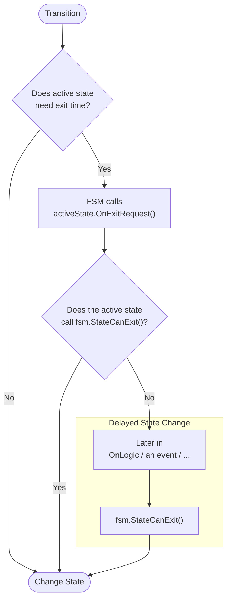
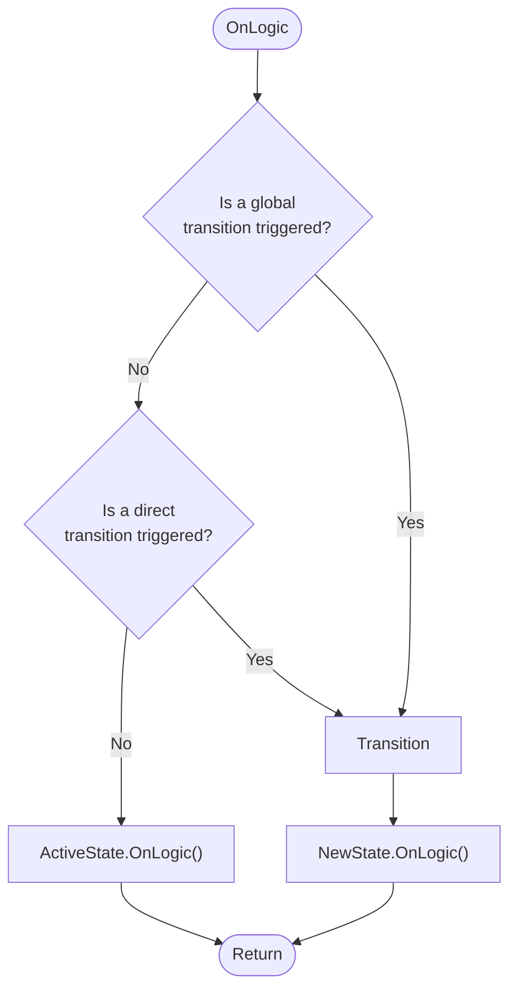

<p align="center">
  <a href="https://github.com/Inspiaaa/UnityHFSM">
    </a>
  <a href="https://github.com/Inspiaaa/UnityHFSM/blob/master/LICENSE.md" alt="GitHub license">
    </a>
  <a href="https://github.com/Inspiaaa/UnityHFSM/releases" alt="GitHub release">
    </a>
  <a href="https://openupm.com/packages/com.inspiaaa.unityhfsm/">
    </a>
</p>

一个简单而强大的**层次化有限状态机**，专为Unity游戏引擎设计。它通过**基于类**的方式实现可扩展性和可定制性，同时也支持函数（lambda表达式）以便**快速原型设计**。

得益于方法重载，它最大限度地减少了样板代码，同时仍然支持**泛型**。

它特别关注状态转换的时间方面，使其成为处理对时间和同步敏感问题的理想选择。

---

### 为什么使用UnityHFSM？

- 状态机是一种极好的方式来编写和组织游戏逻辑。（只要你有状态，例如行走、奔跑、潜行、跳跃，你就可以使用状态机）

- 它使用起来**简单**且**直接**

- 它帮助你**驾驭复杂行为**（例如武器处理->冷却、弹药、装填、射击）或为NPC编写AI

- 帮助你编写**自文档化代码**，使其**可维护**且**可读**

- **减少**编写状态机所需的**样板代码**

- UnityHFSM是**轻量级**且**高效**的，使其成为解决小型和大型问题的完美工具

- 它**专为Unity设计**，并支持**协程**，而这些在状态机中通常很难集成

- 在设置状态机后，状态变更/更新/...过程中**无GC分配**（->没有因状态机导致的不必要的GC相关延迟尖峰）

- 代码**文档完善**

- 它**不是一个组件**（MonoBehaviour），因此有**低开销**

- 通过层次化结构，它可以减少状态之间的重复代码

---

**在wiki中：**

- [功能的完整概述](https://github.com/Inspiaaa/UnityHFSM/wiki/Feature-Overview)

- [如何在Unity外使用UnityHFSM](https://github.com/Inspiaaa/UnityHFSM/wiki/Using-UnityHFSM-outside-of-Unity)

**目录：**

- [快速原型设计](#simple-state-machine)

- [层次化功能](#hierarchical-state-machine)

- [状态变更的时间控制](#timing-of-state-changes)

- [层次化时间控制](#hierarchical-timing)

- [多种状态变更模式](#state-change-patterns)

- [OnLogic的控制流](#control-flow-of-onlogic)

- [Unity **协程**](#unity-coroutines)

- [可扩展（基于类）](#class-based-architecture)

- [泛型](#generics)

- [调试技巧](#debugging-tips)

## 安装

### Unity包

要开始使用，请从[Releases](https://github.com/Inspiaaa/UnityHFSM/releases)页面下载最新版本的UnityHFSM。只需解压缩文件并将文件夹放在你的`Assets`文件夹中的任何位置。就这样，你准备好了！

### UPM包

<details>
<summary>从OpenUPM添加 <em>| 通过作用域注册表</em></summary>

要将OpenUPM添加到你的项目：

- 打开`Edit/Project Settings/Package Manager`

- 添加一个新的作用域注册表：
  
  ```
  Name: OpenUPM
  URL:  https://package.openupm.com/
  Scope(s): com.inspiaaa.unityhfsm
  ```

- 点击<kbd>Save</kbd>

- 打开Package Manager

- 在左上角的下拉菜单中选择``My Registries``

- 选择``UnityHFSM``并点击``Install``
  
  </details>

<details>
<summary>从GitHub添加 | <em>无法通过PackMan更新</em></summary>

你也可以在Unity 2019.4+上直接从GitHub添加它。请注意，通过这种方式你将无法通过Package Manager接收更新，你必须手动更新。

- 打开Package Manager（<kbd>Window</kbd> > <kbd>Package Manager</kbd>）
- 点击<kbd>+</kbd>
- 选择<kbd>Add from Git URL</kbd>
- 粘贴
  - `https://github.com/Inspiaaa/UnityHFSM.git#upm` 获取最新稳定版本（**推荐**）
  - `https://github.com/Inspiaaa/UnityHFSM.git#release` 获取开发版本
  - `https://github.com/Inspiaaa/UnityHFSM.git#v1.8.0` 获取特定版本（这里是`v1.8.0`）
- 点击<kbd>Add</kbd>
- 提示：如果你使用VSCode，且没有得到任何IntelliSense支持，你可能需要重新生成`.csproj`项目文件（<kbd>Edit</kbd> > <kbd>Preferences</kbd> > <kbd>External Tools</kbd> > <kbd>Regenerate project files</kbd>）

</details>

---

## 示例

## 简单状态机

这是一个游戏中敌方间谍的简单状态机。


如你所见，敌人会尝试在提取情报时保持在玩家视线范围之外。当玩家走得太远时，它会再次跟随玩家。

### 思路

- **创建状态机：**
  
  ```csharp
  fsm = new StateMachine();
  ```

- **添加状态：** 每个状态由一个`StateBase`对象表示。你可以使用内置的状态类（例如`State`类）来定义状态的逻辑，或者编写一个继承自`StateBase`的自定义类。
  
  ```csharp
  fsm.AddState(
      name,
      new State(
          onEnter,
          onLogic,
          onExit
      )
  );
  ```

- **添加转换：** 转换可以使用`TransitionBase`对象定义。它们决定何时以及在什么条件下状态机应该切换到另一个状态。与状态一样，最简单的选择是使用内置的转换类型（例如`Transition`类）。如果你选择通过继承`TransitionBase`创建自定义转换类，请参阅[基于类的架构部分](#class-based-architecture)了解更多信息。
  
  ```csharp
  fsm.AddTransition( new Transition(
      from,
      to,
      condition
  ));
  ```

- **初始化状态机**
  
  ```csharp
  fsm.SetStartState(id);
  fsm.Init();
  ```

- **运行状态机：**
  
  ```csharp
  void Update() {
      fsm.OnLogic()
  }
  ```

### 实现

#### 创建状态机

```csharp
using System.Collections;
using System.Collections.Generic;
using UnityEngine;
using UnityHFSM;  // 导入状态机所需的类。

public class EnemyController : MonoBehaviour
{
    private StateMachine fsm;

    public float playerScanningRange = 4f;
    public float ownScanningRange = 6f;

    void Start()
    {
        fsm = new StateMachine();
    }
}
```

#### 添加状态

为了能够简洁地定义状态逻辑，我们首先需要创建一些辅助方法和属性。它们的实现只是一个示例，可能因你的场景设置而异。

```csharp
Vector2 PlayerPosition => PlayerController.Instance.transform.position;

float DistanceToPlayer => Vector2.Distance(PlayerPosition, transform.position);

void MoveTowardsPlayer(float speed) {
    transform.position = Vector2.MoveTowards(
        transform.position,
        PlayerPosition,
        speed * Time.deltaTime
    );
}
```

接下来，我们可以在`Start`方法中定义状态：

```csharp
void Start()
{
    fsm = new StateMachine();

    // 没有任何逻辑的空状态。
    fsm.AddState("ExtractIntel");

    fsm.AddState("FollowPlayer", new State(
        onLogic: state => MoveTowardsPlayer(1)
    ));

    fsm.AddState("FleeFromPlayer", new State(
        onLogic: state => MoveTowardsPlayer(-1)
    ));

    // 这配置了状态机的入口点。
    fsm.SetStartState("FollowPlayer");
}
```

注意`fsm.AddState("ExtractIntel")`调用。有趣的是，我们不需要在这里传递状态对象。这是由于UnityHFSM提供的众多**"快捷"方法**之一。这些方法旨在减少常见操作（如添加空白状态）所需的样板代码量。上面的行等同于编写：

```csharp
fsm.AddState("ExtractIntel", new StateBase<string>(needsExitTime: false));
```

此外，我们实际上可以通过使用快捷方法来进一步缩短其他状态定义。例如，我们可以以更简洁的方式编写`FollowPlayer`状态：

```csharp
fsm.AddState("FollowPlayer", onLogic: state => MoveTowardsPlayer(1));
```

虽然此示例使用lambda表达式来表示状态逻辑，但你当然也可以传递普通函数。

> **旁注：** 为了保持简单，我们使用字符串作为状态标识符。只需记住，UnityHFSM不限于此，因为它允许你使用任何自定义类型（例如枚举）作为状态标识符。有关更多信息，请参阅[泛型](#generics)章节。

#### 添加转换

```csharp
void Start()
{
    // ...

    fsm.AddTransition(new Transition(
        "ExtractIntel",
        "FollowPlayer",
        transition => DistanceToPlayer > ownScanningRange
    ));

    fsm.AddTransition(new Transition(
        "FollowPlayer",
        "ExtractIntel",
        transition => DistanceToPlayer < ownScanningRange
    ));

    fsm.AddTransition(new Transition(
        "ExtractIntel",
        "FleeFromPlayer",
        transition => DistanceToPlayer < playerScanningRange
    ));

    fsm.AddTransition(new Transition(
        "FleeFromPlayer",
        "ExtractIntel",
        transition => DistanceToPlayer > playerScanningRange
    ));
}
```

尽管上面的代码片段肯定是有效的，但你可能会注意到它看起来有点过于冗长和重复。确实如此。我们可以做得更好！

首先，由于使用`Transition`类创建转换是如此常见，所以有快捷方法来最小化样板代码量。第一个转换等同于编写：

```csharp
fsm.AddTransition("ExtractIntel", "FollowPlayer",
    transition => DistanceToPlayer > ownScanningRange);
```

其次，在条件为真时定义一个方向的转换，在条件为假时定义另一个方向的转换是一种常见模式。UnityHFSM提供了一个特殊功能来在代码中实现这一点：双向转换。通过结合此功能和快捷方法，我们可以将原始代码片段减少为以下内容：

```csharp
fsm.AddTwoWayTransition("ExtractIntel", "FollowPlayer",
    transition => DistanceToPlayer > ownScanningRange);

fsm.AddTwoWayTransition("ExtractIntel", "FleeFromPlayer",
    transition => DistanceToPlayer < playerScanningRange);
```

#### 初始化和运行状态机

```csharp
void Start()
{
    // ...

    // 初始化状态机，必须在调用OnLogic()之前调用。
    fsm.Init();
}

void Update()
{
    fsm.OnLogic();
}
```

此时，敌人控制器的基本版本已完成，可以使用了 :D

顺便说一下，使用所有上述技巧，整个状态机的定义可以减少到非常少的代码行：

```csharp
void Start()
{
    fsm = new StateMachine();

    fsm.AddState("ExtractIntel");
    fsm.AddState("FollowPlayer", onLogic: state => MoveTowardsPlayer(1));
    fsm.AddState("FleeFromPlayer", onLogic: state => MoveTowardsPlayer(-1));

    fsm.SetStartState("FollowPlayer");

    fsm.AddTwoWayTransition("ExtractIntel", "FollowPlayer",
        transition => DistanceToPlayer > ownScanningRange);
    fsm.AddTwoWayTransition("ExtractIntel", "FleeFromPlayer",
        transition => DistanceToPlayer < playerScanningRange);

    fsm.Init();
}
```

## 层次化状态机

在处理更复杂的行为时，将问题分解为子问题是很自然的。这种方法完美地映射到状态机上。首先定义状态，然后在后续步骤中添加逻辑和行为。在设计状态时，有时只为它绘制另一个状态图并思考如何分解其行为是很有用的。这样做的结果是状态的层次结构——一个层次化状态机。

如何在UnityHFSM中实现这一点？

因为`StateMachine`类继承自`StateBase`，所以它可以被视为普通状态。这允许状态机与状态一起嵌套。除此之外，UnityHFSM还提供了额外的功能来描述状态机的时间控制/退出条件（稍后会详细介绍）。

### 扩展前面的例子


在前面的例子中，我们将`Extract Intel`状态留空。让我们改变这一点。在提取情报时，间谍应该先收集数据，然后发送数据，完成后重复此过程。

为了让你看到视觉上的差异，让我们让敌人在进入`Send Data`状态时旋转，就像它在向所有方向发送数据一样。

### 思路

- 为嵌套状态（`Extract Intel`中的状态）创建一个单独的状态机

- 将嵌套状态添加到新的状态机

- 将新的状态机作为普通状态添加到主状态机

### 实现

#### ExtractIntel状态的单独FSM

```csharp
void Start()
{
    // 这是主状态机。
    fsm = new StateMachine();

    // 这是嵌套状态机。
    var extractIntel = new StateMachine();
    fsm.AddState("ExtractIntel", extractIntel);

    // ...
}
```

#### 添加状态和转换

我们希望敌人在`CollectData`和`SendData`状态中各停留5秒。有几种方法可以实现这一点。

一种选择是使用内置的`TransitionAfter`类来定义仅在特定延迟后激活的转换。使用它看起来像这样：

```csharp
extractIntel.AddTransition(new TransitionAfter("CollectData", "SendData", 5));
```

另一种选择是使用UnityHFSM的时间控制功能。我们可以添加没有条件的转换，因此应该使状态机立即进入下一个状态。同时，我们声明`CollectData`和`SendData`状态需要"退出时间"，这意味着转换应该只在活动状态准备好并且可以干净地退出时发生。有关更多详细信息，请参见下面的代码片段和下一节。

```csharp
void RotateAtSpeed(float speed)
    => transform.eulerAngles += new Vector3(0, 0, speed * Time.deltaTime);

void Start()
{
    fsm = new StateMachine();

    var extractIntel = new StateMachine();
    fsm.AddState("ExtractIntel", extractIntel);

    extractIntel.AddState("SendData",
        onLogic: state => {
            // 当状态活动超过5秒时，
            // 通知fsm状态可以干净地退出。
            if (state.timer.Elapsed > 5)
                state.fsm.StateCanExit();

            // 让敌人以每秒100度的速度旋转。
            RotateAtSpeed(100f);
        },
        // 这意味着当转换应该发生时，状态不会立即退出，
        // 而是状态机等待直到它获得改变状态的许可。
        needsExitTime: true
    );

    extractIntel.AddState("CollectData",
        // canExit函数是定义状态何时允许退出的另一种方式
        // （它在内部调用`fsm.StateCanExit()`）。
        canExit: state => state.timer.Elapsed > 5,
        needsExitTime: true
    );

    extractIntel.SetStartState("CollectData");

    // 没有条件的转换。
    extractIntel.AddTransition("SendData", "CollectData");
    extractIntel.AddTransition("CollectData", "SendData");

    // ...
}
```

## 状态变更的时间控制

状态变更的时间由活动状态的`needsExitTime`属性控制。

当`needsExitTime = false`时，状态可以在任何时间点退出，例如因为转换，无论其当前内部状态如何。

当`needsExitTime = true`时，这种情况就不会发生。它表明状态机可能需要更多时间才能准备好退出。任何应该发生的转换都会被延迟，成为"挂起转换"。当你不希望动作在结束前被中断时，这非常有用，就像上面的例子那样。（这可以通过使用`forceInstantly = true`强制转换来跳过/覆盖）。

但什么时候是状态机最终改变状态的正确时机呢？这就是`fsm.StateCanExit()`方法的用途。调用`fsm.StateCanExit()`通知状态机状态可以干净地退出。如果有挂起的转换，它将被执行。

以下是当转换应该发生时一般情况下会发生的事情：

1. 状态机调用`activeState.OnExitRequest()`。如果状态可以退出，它应该调用`fsm.StateCanExit()`。

2. 如果状态在调用`OnExitRequest()`时不能退出，则活动状态必须在稍后的时间点通知状态机它可以退出，方法是调用`fsm.StateCanExit()`方法。这可以发生在`OnLogic`调用中或当事件被触发时。



另一个方便的功能是`State`类的`canExit`属性。它允许你以声明方式编写状态何时准备好退出。在内部，传递的`canExit`函数在每次退出请求和每次逻辑调用（如果有挂起的转换）时被调用。如果它返回true，则调用`fsm.StateCanExit()`。在上面的例子中，使用此功能的`SendData`代码可能如下所示：

```csharp
extractIntel.AddState("SendData",
    onLogic: state => RotateAtSpeed(100f),
    canExit: state => state.timer.Elapsed > 5,
    needsExitTime: true
);
```

## 层次化时间控制

> 警告：这是UnityHFSM最高级和最复杂的功能之一。其他章节更容易理解。

### 思路

虽然`CollectData`和`SendData`状态都将其`needsExitTime`属性设置为true，但如果玩家移动太近或太远，状态机将立即退出它们。毕竟，持有这两个状态的嵌套状态机没有设置自己的`needsExitTime`属性为true。

要解决这个问题，我们可以简单地在`ExtractIntel`状态机中设置`needsExitTime = true`。然而，这引出了另一个问题：嵌套状态机何时允许退出？以及我们如何表明它允许退出？

答案是使用**退出转换**。这些是只在父状态机有挂起转换时才会检查的特殊转换——换句话说，当父状态机希望嵌套状态机退出时。当转换成功时，嵌套状态机退出，以便父状态机可以转换到其下一个状态。准确地说，嵌套状态机只有在退出转换成功*且*其当前活动状态准备好退出时才会退出（当`needsExitTime = false`时总是如此，否则当调用`StateCanExit()`时）。

让我们在示例中使用此功能。以下是我们要做的事情：

- 在收集数据时，间谍应该能够随时退出`ExtractIntel`状态。这可以通过从`ExtractIntel`添加退出转换来实现。

- 一旦所有数据被收集，它应该发送出去，无论玩家在哪里。即使玩家太远，也无关紧要，因为数据已经收集好了。为了简单起见，让我们假设敌人也会尝试完成发送阶段，即使它冒着因靠得太近而被玩家发现的风险。


### 实现

首先，我们将编辑`Start`方法，使嵌套状态机的`needsExitTime`设置为true：

```csharp
var extractIntel = new StateMachine(needsExitTime: true);
```

其次，状态机应该能够随时退出`CollectData`，这意味着其`needsExitTime`应该设置为false。这意味着我们稍后也需要使用`TransitionAfter`转换。

```csharp
extractIntel.AddState("CollectData");  // 默认情况下needsExitTime = false
```

最后，我们还必须添加转换。`SendData --> CollectData`转换可以保持不变。由于`CollectData`现在可以立即退出（`needsExitTime = false`），但我们只想在5秒后转换到`SendData`，我们必须使用`TransitionAfter`转换。此外，我们必须添加退出转换。

```csharp
extractIntel.AddTransition("SendData", "CollectData");

// 没有条件的退出转换。
extractIntel.AddExitTransition("CollectData");

extractIntel.AddTransition(new TransitionAfter("CollectData", "SendData", 5));
```

在上面的代码片段中，有两点需要注意：

- 添加退出转换的那行使用了一个快捷方法。它大致相当于编写：
  
  ```csharp
  extractIntel.AddExitTransition(new Transition("CollectData", ""));
  ```
  
  我们不需要定义条件，因为只有在主状态机尝试从`ExtractIntel`转换到另一个状态时才会检查它。

- 转换的顺序很重要。首先添加的转换也会首先检查，因此具有最高的优先级。在这种情况下，我们希望优先考虑退出转换而不是正常转换到`SendData`状态，因此它首先被添加。

> **提示：** 在调试复杂的层次化状态机时，不仅知道根状态机中哪个状态是活动的（使用`fsm.ActiveStateName`）非常有用，还要知道嵌套状态机中哪些状态是活动的。
> 
> 这就是为什么UnityHFSM有一个功能来做这个：
> 
> ```csharp
> print(fsm.GetActiveHierarchyPath());
> ```
> 
> 示例输出：`/ExtractIntel/CollectData`。
> 
> 然后你可以在每次调用`Update()`时使用它来调试状态机。

如何修改代码使敌方间谍在玩家靠得太近时中止发送数据？这意味着我们想立即退出`ExtractIntel`状态并转到`FleeFromPlayer`状态。这需要我们通过将其转出转换到`FleeFromPlayer`标记为强制转换（`forceInstantly = true`）来覆盖`ExtractIntel`的`needsExitTime`属性。

```csharp
fsm.AddTwoWayTransition("ExtractIntel", "FleeFromPlayer",
    transition => DistanceToPlayer < playerScanningRange,
    forceInstantly: true);
```

为了简单起见，`ExtractIntel`和`FleeFromPlayer`之间的转换在两个方向上都是强制的（因为我们使用了双向转换）。在我们的例子中没有任何区别。然而，如果你想只在一个方向上强制它，你可以简单地创建两个单独的转换。

## 状态变更模式

状态机支持三种改变状态的方式：

1. 使用前面描述的`Transition`对象。你甚至可以有多个连接相同两个状态的转换。它们在每次`OnLogic`调用时被检查，可以被视为一种**轮询**。
   
   ```csharp
   fsm.AddTransition(
       new Transition(
           from,
           to,
           condition
       )
   );
   ```

2. 调用`RequestStateChange`方法：除了使用`Transition`对象管理状态变更外，每个状态还可以通过**直接**调用`RequestStateChange`方法来单独管理其自己的转换。
   
   ```csharp
   fsm.RequestStateChange(state, forceInstantly: false);
   ```
   
   **示例**
   
   ```csharp
   fsm.AddState("FollowPlayer", new State(
       onLogic: (state) =>
       {
           MoveTowardsPlayer(1);
   
           if (DistanceToPlayer() < ownScanningRange)
           {
               fsm.RequestStateChange("ExtractIntel");
           }
       }
   ));
   ```

3. 使用"触发转换"：这些是只在特定触发器（事件）被激活时才会检查的普通转换。
   
   当基于轮询的解决方案不合适或效率不高时，这些非常有用。触发转换让你轻松利用**基于事件**的转换的效率，结合现有高级转换类型的全部功能。
   
   ```csharp
   fsm.AddTriggerTransition(triggerName, transition);
   ```
   
   **示例**
   
   ```csharp
   // Flappy Bird示例
   fsm.AddTriggerTransition(
       "OnCollision",
       new Transition("Alive", "Dead")
   );
   
   // 稍后
   fsm.Trigger("OnCollision");
   ```

因此，UnityHFSM支持**基于轮询和基于事件**的转换，以及完全绕过转换概念的功能。这相当酷。

`Transition`状态变更行为还有一种变体，允许你从**任何**其他状态更改到特定状态（"全局"转换，而不是"本地"/"直接"转换）。它们具有与普通转换相同的`forceInstantly` / `needsExitTime`处理。

```csharp
fsm.AddTransitionFromAny( new Transition(
    from,
    to,
    condition
));

// 对于触发转换
fsm.AddTriggerTransitionFromAny(
    triggerName,
    transition
);
```

**示例**

```csharp
fsm.AddTransitionFromAny( new Transition(
    "",    // From可以留空，因为在这种情况下没有意义
    "Dead",
    t => (health <= 0)
));

// 对于触发转换
fsm.AddTriggerTransitionFromAny(
    "OnDamage",
    new Transition("", "Dead", t => (health <= 0))
);
```

## OnLogic的控制流

每个StateMachine的`OnLogic`方法通过`Transition`（`TransitionBase`）对象管理自动转换和活动状态的逻辑函数。

以下是发生的情况：

1. 状态机检查所有全局转换（从任何状态的转换），看是否应该发生转换。如果是这种情况，状态机将前进到新状态，并调用新状态的`OnLogic`函数。

2. 如果不是这种情况，fsm检查所有直接转换（直接从活动状态到另一个状态的转换），看是否应该发生转换。如果是这种情况，状态机将前进到新状态，并调用新状态的`OnLogic`函数。

3. 如果不是这种情况，fsm最终将调用当前活动状态的`OnLogic`函数。

因为全局转换首先被检查，所以它们具有最高优先级。这一设计决策可以通过以下示例说明：当玩家的健康值低于0时，无论fsm处于哪个状态，它都应该转换到`Dead`状态。

正如上面提到的步骤，每次`OnLogic`调用只能发生一次转换。这有很多原因，其中之一是状态机不会陷入无限循环。



然而，在一次`OnLogic`调用中执行多次转换有一种方法：一旦状态机进入标记为**"幽灵状态"**的状态，它将立即尝试其所有出站转换。如果任何一个成功，它将立即转换到下一个状态。

示例：

```csharp
fsm.AddState("A");
fsm.AddState("B", new State(isGhostState: true));
fsm.AddState("C");

fsm.AddTriggerTransition("Event", "A", "B");
fsm.AddTransition("B", "C");
```

在稍后的某个时刻，当触发`Event`时，状态机将退出`A`，进入`B`，退出`B`，进入`C`，并最终调用`C`的`OnLogic`方法：

```csharp
fsm.Trigger("Event");
```

## Unity协程

通过使用`CoState`类，你可以运行协程。该类自动处理以下事项：

- 启动协程

- 可选：协程完成后再次运行

- 状态退出时终止协程

由于[C#语言的限制](https://stackoverflow.com/questions/35473442/yield-return-in-the-lambda-expression)，你不能使用lambda表达式来定义IEnumerators（=>协程）。

以下是我们如何在示例中使用它：我们可以用更高级的状态替换`SendData`状态，使间谍在一个方向上转动两秒钟，然后在另一个方向上转动相同的时间。

```csharp
IEnumerator SendData() 
{
    var timer = new Timer();

    while (timer.Elapsed < 2)
    {
        RotateAtSpeed(100f);
        // 等待直到下一帧。
        yield return null;
    }

    while (timer.Elapsed < 4)
    {
        RotateAtSpeed(-100f);
        yield return null;
    }

    // 因为needsExitTime为true，我们必须告诉FSM
    // 何时可以安全地退出状态。
    fsm.StateCanExit();
}

void Start()
{
    // ...

    extractIntel.AddState("SendData", new CoState(
        this,   // 传入应该运行协程的MonoBehaviour。
        SendData,
        loop: true,  // 完成后重复协程。
        needsExitTime: true
    ));

    // ...
}
```

`CoState`类还允许你传入一个接受`CoState`作为参数的迭代器函数。由于UnityHFSM内部实现的继承层次结构及其对泛型的支持方式所导致的副作用之一是，该函数必须将状态作为`CoState<string, string>`对象接收，而不是简单地作为`CoState`：

```csharp
IEnumerator SendData(CoState<string, string> state)
{
    // ...
}
```

> **提示：** 在设计状态机时，有时很难决定何时使用嵌套状态机，何时通过`CoState`使用协程。虽然两者通常都能达到预期的结果，但一种实现方式可能比另一种简单得多。一般来说，如果你发现状态图类似于流程图，则使用协程，否则使用层次化状态机。

## 自定义事件

默认情况下，UnityHFSM使用三个主要事件：
- On Enter：状态机已切换到此状态。
- On Logic：状态机检查基于轮询的转换并更新活动状态。
- On Exit：状态机已切换到另一个状态。

在Unity中，一个更新函数（on logic）通常不够，因为我们有时想在`FixedUpdate`或`LateUpdate`调用中运行代码。在UnityHFSM中，我们可以通过**动作系统**向状态机添加此类自定义事件。有关更多信息和使用说明，你可以查看完整的[功能概述wiki页面](https://github.com/Inspiaaa/UnityHFSM/wiki)。

## 基于类的架构

UnityHFSM从根本上采用面向对象的设计方式，这使你可以轻松创建自定义状态和转换类型。只需继承通用基类（`StateBase`、`TransitionBase`），就可以开发自定义状态和转换。这也是内置状态和转换类型（如`CoState`和`TransitionAfter`）在内部实现的方式。

以下是你可以重写的方法概述：

**创建自定义状态**

```csharp
class CustomState : StateBase
{
    public CustomState()
        : base(needsExitTime: false, isGhostState: false) { }

    public override void Init() { }

    public override void OnEnter() { }
    public override void OnLogic() { }
    public override void OnExit() { }

    public override void OnExitRequest() { }
}
```

**创建自定义转换**

```csharp
class CustomTransition : TransitionBase
{
    public CustomTransition(string from, string to)
        : base(from, to, forceInstantly: false) { }

    public override bool ShouldTransition() { return true; }

    public override void Init() { }

    public override void BeforeTransition() { }
    public override void AfterTransition() { }
}
```

在开发自定义状态和转换类时，了解UnityHFSM如何处理泛型（见下文）以及继承层次结构的结构（见[wiki](https://github.com/Inspiaaa/UnityHFSM/wiki/State-Classes)）也是值得的，这样你就可以在你的类中支持自定义动作（事件）。

## 泛型

UnityHFSM还提供了对泛型的一流支持。这意味着如果你不想使用字符串作为状态标识符和事件，你可以轻松使用不同的数据类型，例如`int`、枚举、自定义类，甚至布尔值...

使用字符串以外的类型的优势：

- 它可以提高状态机的**安全性**，因为它可以防止字符串状态名称中的拼写错误导致错误。使用枚举可以确保状态标识符在编译时被检查。

- 它可以更好地映射到不同类型的问题，例如使用`int`事件表示HTTP响应状态码而不是字符串。

- 它可以极大地**提高状态机的基本性能**。使用int或枚举作为状态标识符可以加速内部机制，根据使用情况最多可提高50%。
  
  > **旁注：** UnityHFSM已经高度优化，在大多数情况下，用户代码中花费的时间远远超过状态机内部执行转换/更新调用所花费的时间。然而，在极少数情况下，减少几纳秒的执行时间会有所不同，你可以使用int或枚举将UnityHFSM的开销降至最低。

给定层次结构中的每个嵌套状态机都可以使用自己的状态标识符类型（`TStateId`）。所有状态机在给定层次结构中必须共享的唯一一点是触发器/事件的类型（`TEvent`），以便它们可以沿层次结构向下传递。

为了实现这一点，`StateMachine`类接受3个泛型类型参数：`TOwnId`、`TStateId`和`TEvent`。`TStateId`是状态机中状态名称的类型，即其子状态。如果你将状态机用作状态（->它将是一个嵌套状态机），它本身需要一个父状态机的标识符。这就是`TOwnId`类型参数。最后，`TEvent`是触发器和事件的类型。参数的顺序是：`StateMachine<TOwnId, TStateId, TEvent>`。

`StateMachine`类还有多个重载，减少了入门所需的样板代码：

- `StateMachine` = `StateMachine<string, string, string>`

- `StateMachine<TStateId>` = `StateMachine<TStateId, TStateId, string>`

- `StateMachine<TStateId, TEvent>` = `StateMachine<TStateId, TStateId, TEvent>`

以下是一个小例子，展示如何混合不同的类型：

```csharp
enum PlayerStates {
    IDLE, MOVE, JUMP
}

enum MoveStates {
    WALK, DASH
}

enum Events {
    ON_DAMAGE, ON_WIN
}
```

```csharp
var fsm = new StateMachine<PlayerStates, Events>();
var moveFsm = new StateMachine<PlayerStates, MoveStates, Events>();
var idleFsm = new StateMachine<PlayerStates, string, Events>();

fsm.AddState(PlayerStates.IDLE, idleFsm);
fsm.AddState(PlayerStates.MOVE, moveFsm);
fsm.AddState(PlayerStates.JUMP, new State<PlayerStates, Events>());
// Or simply using shortcut methods: fsm.AddState(PlayerStates.JUMP);

moveFsm.AddState(MoveStates.WALK);
moveFsm.AddState(MoveStates.DASH);
moveFsm.AddTransition(new Transition<MoveStates>(MoveStates.WALK, MoveStates.DASH));
// Or simply: fsm.AddTransition(MoveStates.WALK, MoveStates.DASH);

idleFsm.AddState("Animation 1", new State<string, Events>());
idleFsm.AddState("Animation 2");

// ...
```

### 关于性能的简短说明

UnityHFSM在设计时同时考虑了功能强大和性能。它旨在提供强大的功能而不妥协效率，使其成为Unity中**小型和复杂项目的理想选择**。

源代码经过仔细基准测试和优化，以在各种用例中保持一致的性能。

它遵循"只为你使用的功能付费"的设计理念，无论是在**内存还是性能**方面。这意味着支持更多功能不会以性能为代价。例如，由于**惰性初始化**，UnityHFSM在较小的场景中仍然非常轻量级。同时，其可扩展的架构和高级功能完全能够有效处理更大、更复杂项目的需求。

## 调试技巧

以下是一些可用于调试复杂状态机的技巧和窍门：

- **错误消息**：当UnityHFSM检测到问题时，它会抛出一个带有详细错误消息的异常，帮助你找出问题并找到解决方案。
  - 通常，抛出的**第一个错误**是最重要的，因为后续错误很可能只是第一个错误的结果。
  - 由于错误消息跨越多行，你必须在Unity编辑器的控制台中**点击错误**才能查看完整消息。

  **示例错误消息：**
  ```
  StateMachineException: 
  In state machine 'Root/Fight'
  Context: Switching states
  Problem: The state "Wait" has not been defined yet / doesn't exist.
  Solution: 
  1. Check that there are no typos in the state names and transition from and to names
  2. Add this state before calling Init / OnEnter / OnLogic / RequestStateChange / ...
  ```

  它解释了错误发生在哪里（在`Fight`子状态机中），出了什么问题（未找到转换的目标状态），以及可能的解决方案。

- 当层次化状态机行为不符合预期时，你可以在根状态机上调用`GetActiveHierarchyPath()`方法并将其结果打印到控制台。它告诉你**层次化状态机中当前哪些状态是活动的**：

  ```csharp
  print(fsm.GetActiveHierarchyPath());  // 例如 "/ExtractIntel/CollectData"
  ```

- 或者，如果你更喜欢**可视化方法**，你可以使用**动画器图表**功能。它在Unity编辑器中创建一个`AnimatorController`，让你直观地了解状态层次结构。同时，它可以实时显示状态机当前处于哪个状态。

  

  你可以在[wiki](https://github.com/Inspiaaa/UnityHFSM/wiki/Visualising-State-Machines-with-Animator-Graphs)中找到关于这个主题的教程。

- 如果你正在处理更高级的代码并想从状态本身内部生成关于当前状态路径的准确信息，而不需要访问根状态机，你可以使用检查相关的代码。`UnityHFSM.Inspection`命名空间是动态工具（如动画器图表功能）的基础，但也可以用于调试（它用于内置错误消息）。特别是，`StateMachineWalker`类可能很有用：

  ```csharp
  print(StateMachineWalker.GetStringPathOfState(this.fsm));  
  // 打印到当前状态的路径。
  // 例如 "Root/Fight/Hit"
  ```

# 开发

如果你想为UnityHFSM开发新代码或为项目做贡献，可以查看[开发wiki页面](https://github.com/Inspiaaa/UnityHFSM/wiki/Development)。它简要介绍了项目文件结构，并简短指导如何运行单元测试。

---

有关更多文档，请查看[Wiki](https://github.com/Inspiaaa/UnityHFSM/wiki)。
